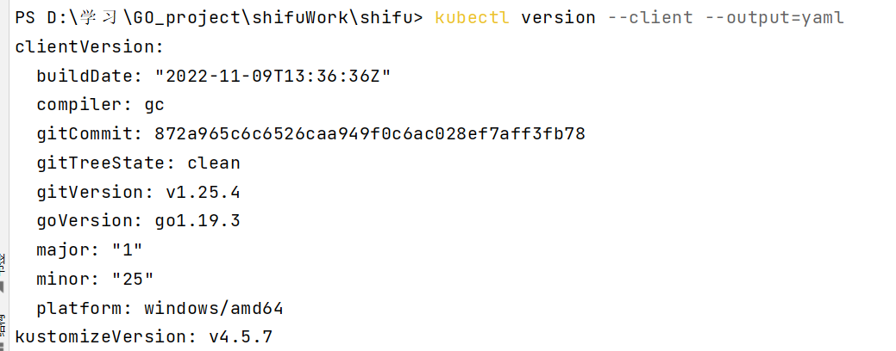
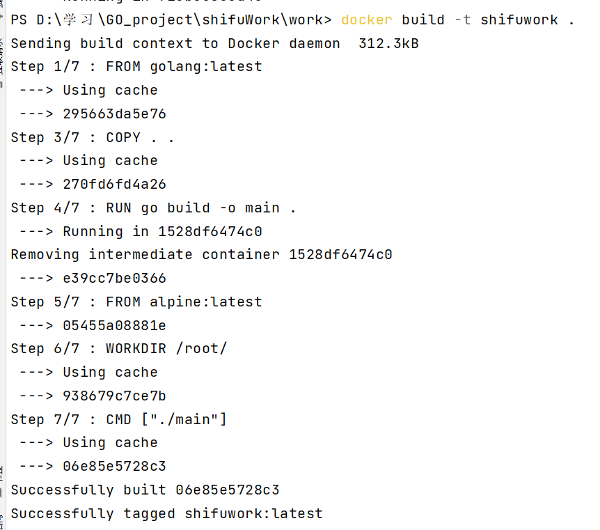
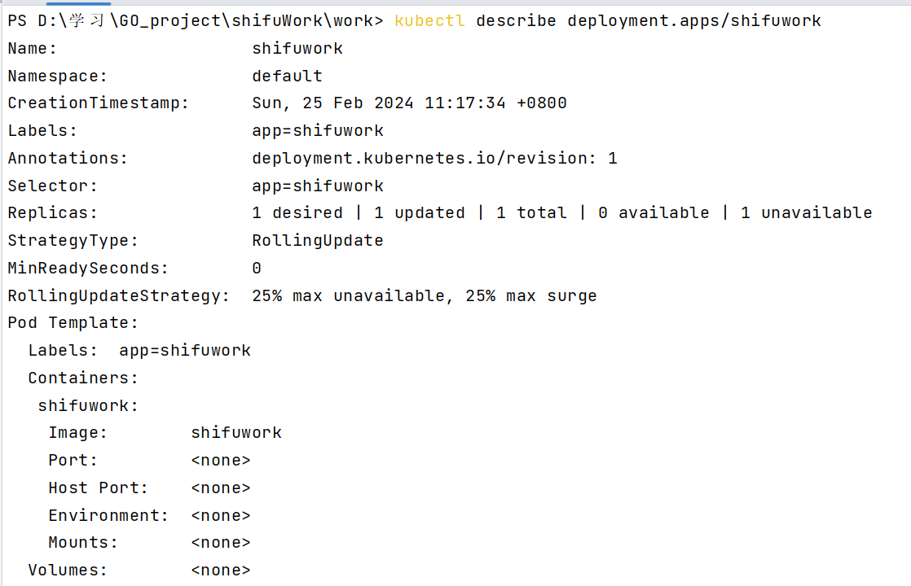

## 笔试题目
- 在Kubernetes中运行Shifu并编写一个应用
## 具体任务
### 1.请参考以下指南，部署并运行Shifu：https://shifu.dev/docs/tutorials/demo-install/
#### 1.安装docker

#### 2.安装kubectl 

#### 3.安装Kind

#### 4.创建集群

#### 5.安装shifu

### 2.运行一个酶标仪的数字孪生：https://shifu.dev/docs/tutorials/demo-try/#3-interact-with-the-microplate-reader
#### 1.启动nginx

#### 2.启动酶标仪的数字孪生


#### 3.进入nginx

#### 4.得到酶标仪的测量结果

### 3. 编写一个Go应用
#### 1.定期轮询获取酶标仪的/get_measurement接口，并将返回值平均后打印出来，轮询时间可自定义
```
package main

import (
	"fmt"
	"io/ioutil"
	"net/http"
	"strconv"
	"strings"
	"time"
)

func main() {
	// 轮询时间间隔，可根据需要自定义
	pollInterval := 10 * time.Second
	// 无限循环执行轮询任务
	for {
		// 发起 HTTP GET 请求获取酶标仪数据
		measurements, err := getMeasurements()
		if err != nil {
			fmt.Printf("Error retrieving measurements: %v\n", err)
			continue
		}
		// 计算平均值
		average := calculateAverage(measurements)
		// 打印平均值
		fmt.Printf("Average measurement: %.2f\n", average)
		// 等待下一次轮询
		time.Sleep(pollInterval)
	}
}

// 发起 HTTP GET 请求获取酶标仪数据
func getMeasurements() ([]float64, error) {
	// 发起 HTTP GET 请求
	resp, err := http.Get("http://deviceshifu-plate-reader.deviceshifu.svc.cluster.local/get_measurement")
	if err != nil {
		return nil, fmt.Errorf("HTTP GET request failed: %v", err)
	}
	defer resp.Body.Close()
	// 读取响应体
	body, err := ioutil.ReadAll(resp.Body)
	if err != nil {
		return nil, fmt.Errorf("Error reading response body: %v", err)
	}
	// 将响应数据解析为浮点数数组
	measurements, err := parseMeasurements(string(body))
	if err != nil {
		return nil, fmt.Errorf("Error parsing measurements: %v", err)
	}
	return measurements, nil
}
// 将响应数据解析为浮点数数组
func parseMeasurements(data string) ([]float64, error) {
	// 按空格拆分数据
	values := strings.Fields(data)
	// 将字符串转换为浮点数
	var measurements []float64
	for _, val := range values {
		measurement, err := strconv.ParseFloat(val, 64)
		if err != nil {
			return nil, fmt.Errorf("Error parsing measurement value: %v", err)
		}
		measurements = append(measurements, measurement)
	}
	return measurements, nil
}
// 计算测量值数组的平均值
func calculateAverage(measurements []float64) float64 {
	var sum float64
	for _, val := range measurements {
		sum += val
	}
	return sum / float64(len(measurements))
}

```
#### 2.Go的应用需要容器化
```dockerfile
FROM golang:latest

WORKDIR /app

COPY . .

RUN go build -o main .

FROM alpine:latest

# 设置工作目录
WORKDIR /root/

# 运行应用
CMD ["./main"]
```
**制作镜像**

**构建容器**

#### 3.Go的应用需要运行在Shifu的k8s集群当中
**在 Shifu 的 Kubernetes 集群中创建一个 Deployment**
`kubectl create deployment shifuwork --image=shifuwork
`

**查看Deployment详细信息**


# shifuWork

